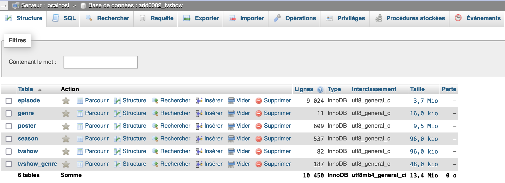
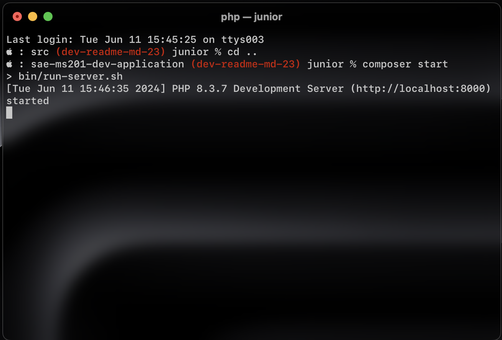

# SAÉ 2.01 - Développement d’une application

## Auteurs

- **ARIDORY Malcolm** (arid0002)
- **VIDAL Martin** (vida0018)

## Sommaire
<!-- TOC -->
* [SAÉ 2.01 - Développement d’une application](#saé-201---développement-dune-application)
  * [Auteurs](#auteurs)
  * [Sommaire](#sommaire)
  * [Introduction](#introduction)
  * [Mise en place du projet](#mise-en-place-du-projet)
    * [Installation et Configuration](#installation-et-configuration)
    * [Serveur local](#serveur-local)
<!-- TOC -->

## Introduction

Ce projet consiste à développer une application web permettant de consulter et de modifier une base de données contenant des informations sur des séries TV.

Cette SAÉ a été réalisée par [VIDAL Martin](https://iut-info.univ-reims.fr/gitlab/vida0018) et [ARIDORY Malcolm](https://iut-info.univ-reims.fr/gitlab/arid0002) (TP2-B)

## Mise en place du projet

### Installation et Configuration

Pour installer ce projet, il suffit d'abord de cloner le dépôt git sur votre machine.

```bash
git clone https:iut-info.univ-reims.fr/gitlab/arid0002/sae-ms204-dev-application.git
```

Ensuite, vous devrez [télécharger le script de création de la base de données](https://iut-info.univ-reims.fr/users/cutrona/restricted/utils/correction/dl.php?f=%2Fbut%2Fs2%2Fsae2-01%2Fressources%2Fjonque01_tvshow.sql)
et l'importer sur votre serveur MySQL sur XAMPP ou sur votre compte au département informatique.



### Serveur local

Pour lancer le serveur local, il y a le script ```bin/run-server.sh``` qui contient la commande suivante :

```bash
#!/usr/bin/env bash

APP_DIR="$PWD" php -d auto_prepend_file="$PWD/vendor/autoload.php" -d display_errors -S localhost:8000 -t public/
```

Si vous êtes sur Linux, vous devrez lancer la commande ```setfacl -m u::rwx bin/run-server.sh``` pour rendre le script 
exécutable. Sur Mac, c'est la commande ```chmod u+rwx bin/run-server.sh```. Sur ces deux systèmes, vous pourrez lancer le
projet en utilisant ```composer start:linux```, ```composer start:mac``` ou tout simplement ```composer:start```. Sur Windows,
utilisez ```composer start:windows``` pour lancer le serveur.

