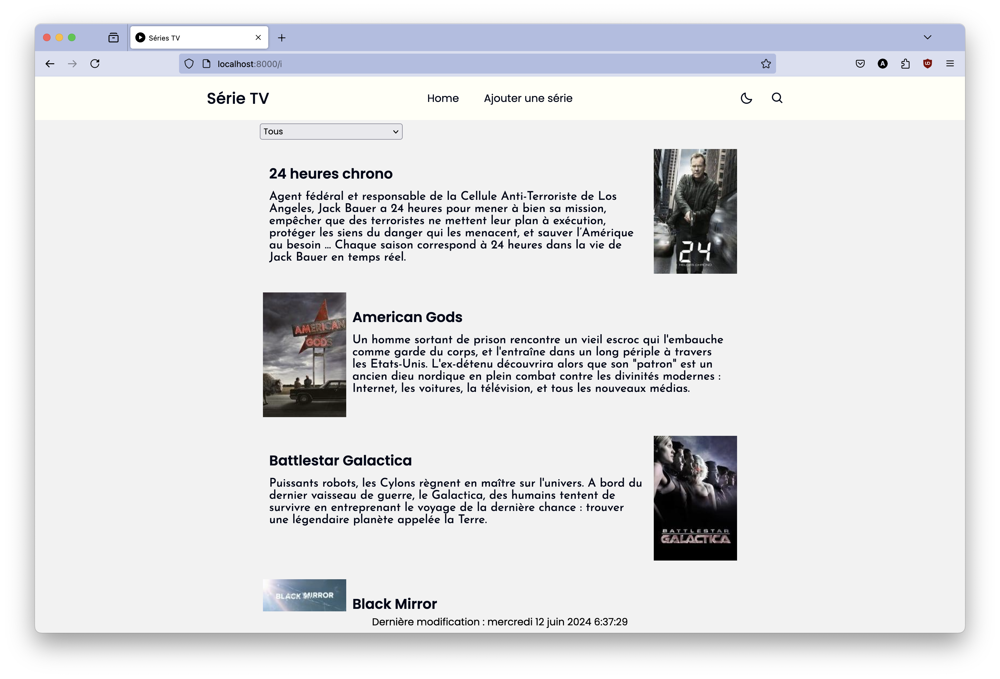
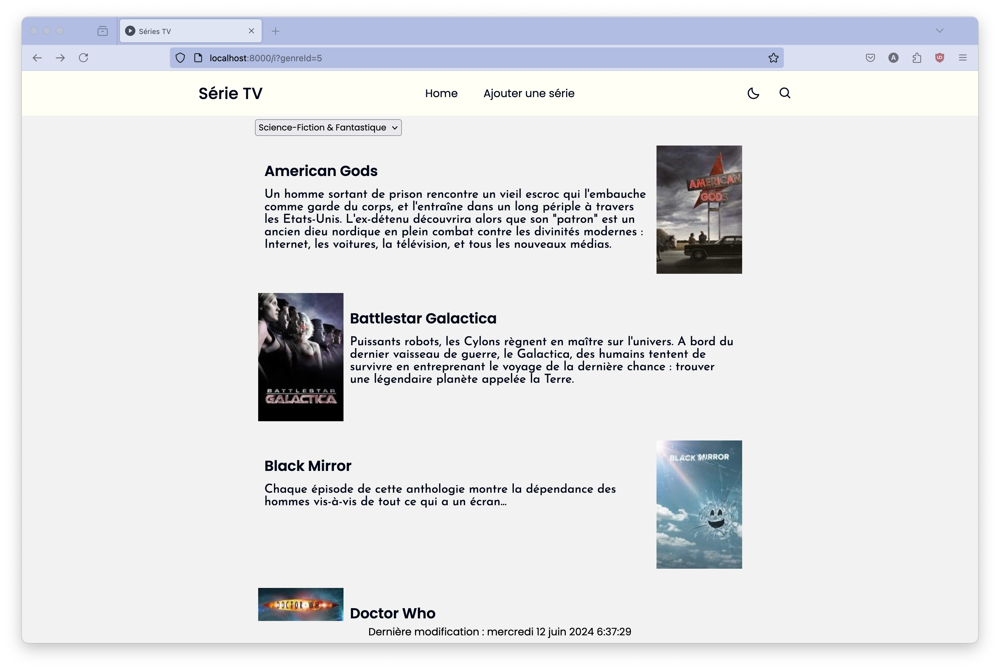
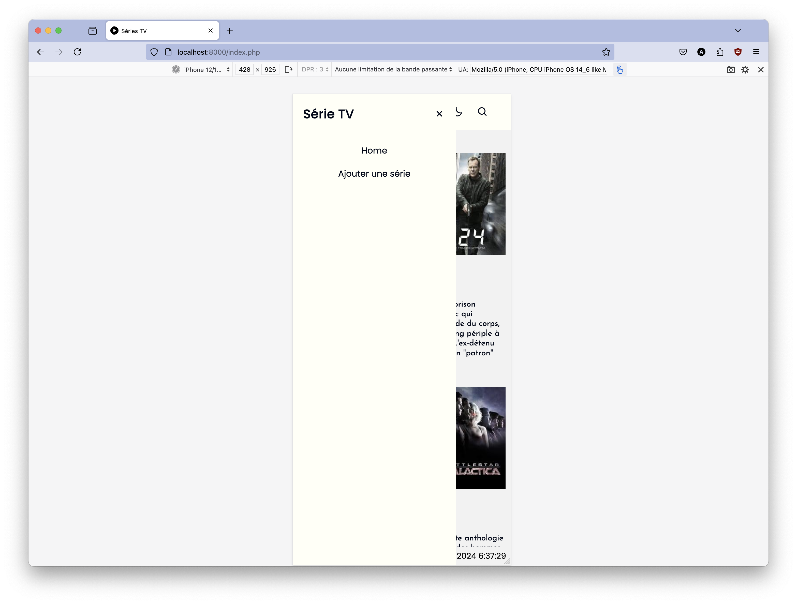
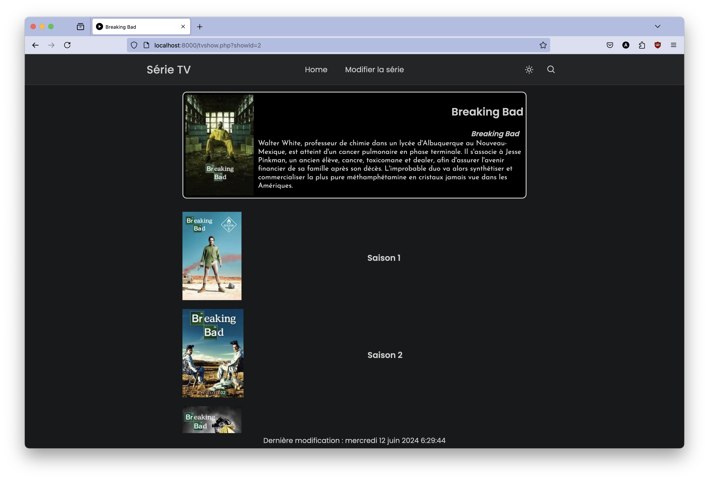
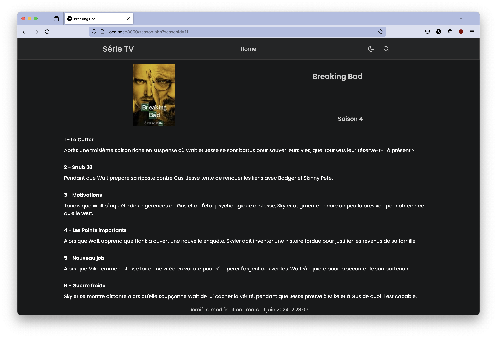
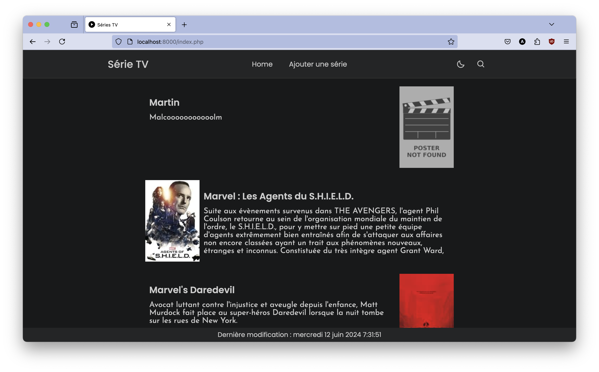
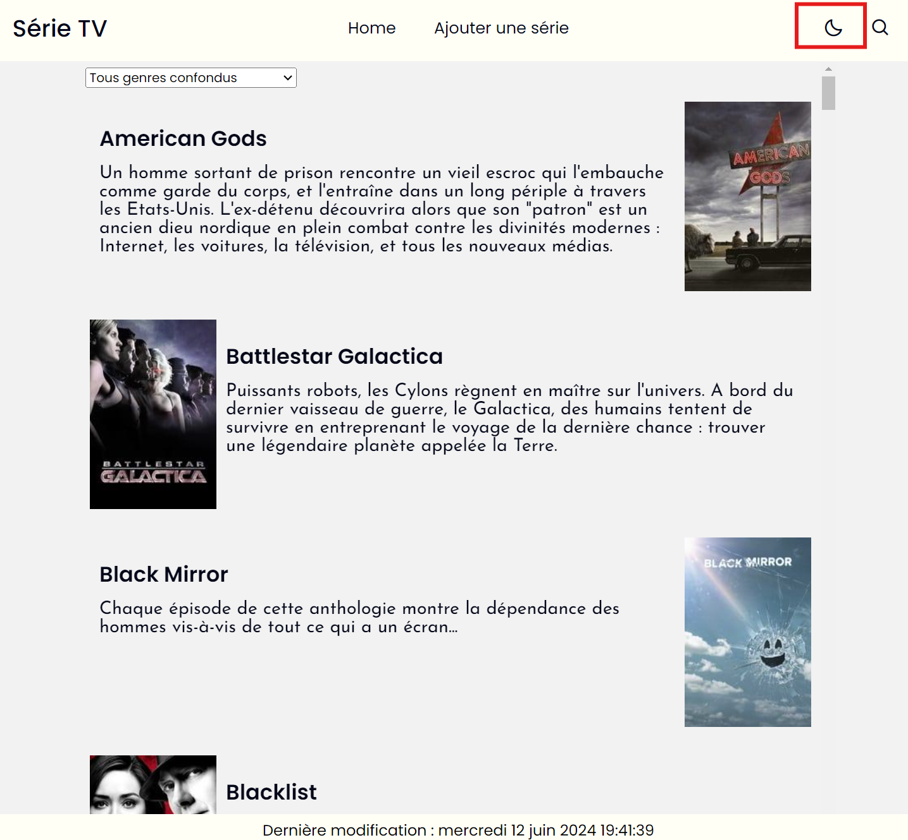
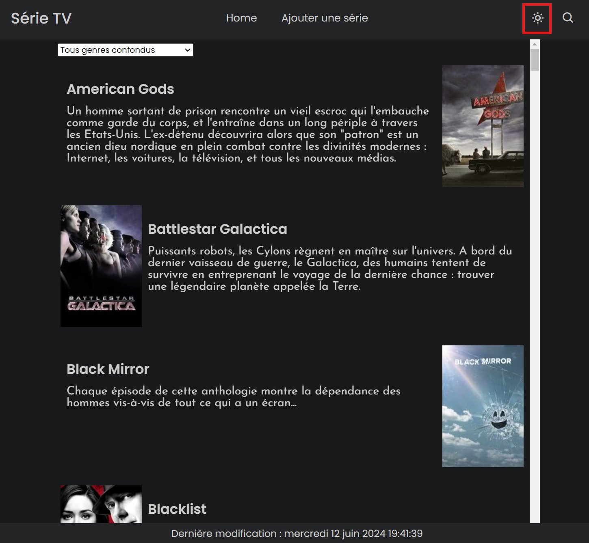
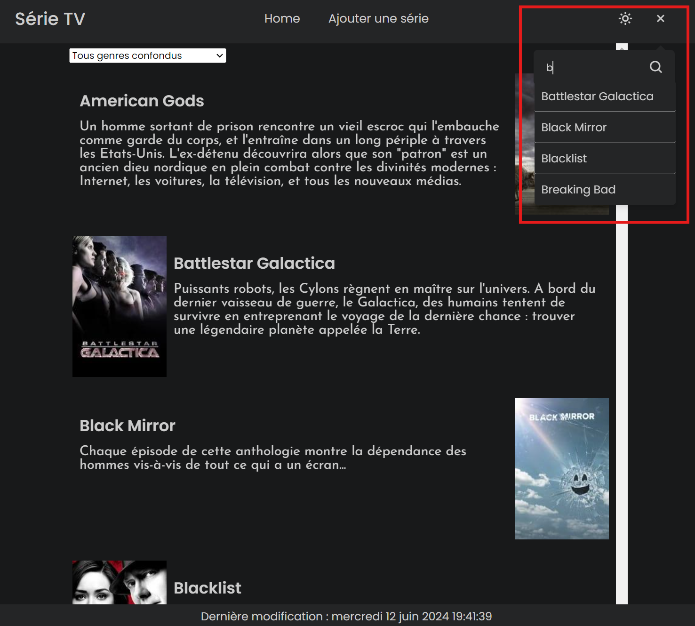

# SAÉ 2.01 - Développement d’une application

## Auteurs

- **ARIDORY Malcolm** (arid0002)
- **VIDAL Martin** (vida0018)

## Sommaire
<!-- TOC -->
* [SAÉ 2.01 - Développement d’une application](#saé-201---développement-dune-application)
  * [Auteurs](#auteurs)
  * [Sommaire](#sommaire)
  * [Introduction](#introduction)
  * [Mise en place du projet](#mise-en-place-du-projet)
    * [Installation et Configuration](#installation-et-configuration)
    * [Serveur local](#serveur-local)
    * [Style de codage](#style-de-codage)
  * [Structure du projet](#structure-du-projet)
  * [Utilisation de l'application](#utilisation-de-lapplication)
    * [Page d'accueil](#page-daccueil-)
    * [Page de série](#page-de-série)
    * [Page de saison](#page-de-saison)
    * [Page d'édition d'une série](#page-dédition-dune-série)
    * [Page d'ajout d'une série](#page-dajout-dune-série)
  * [Fonctionnalités avancées](#fonctionnalités-avancées)
    * [Dark-Mode](#dark-mode)
    * [Search-Bar](#search-bar)
<!-- TOC -->

## Introduction

Ce projet consiste à développer une application web permettant de consulter et de modifier une base de données contenant des informations sur des séries TV.

Cette SAÉ a été réalisée par [VIDAL Martin](https://iut-info.univ-reims.fr/gitlab/vida0018) et [ARIDORY Malcolm](https://iut-info.univ-reims.fr/gitlab/arid0002) (TP2-B)

## Mise en place du projet

### Installation et Configuration

Pour installer ce projet, il suffit d'abord de cloner le dépôt git sur votre machine.

```bash
git clone https:iut-info.univ-reims.fr/gitlab/arid0002/sae-ms204-dev-application.git
```

Ensuite, vous devrez [télécharger le script de création de la base de données](https://iut-info.univ-reims.fr/users/cutrona/restricted/utils/correction/dl.php?f=%2Fbut%2Fs2%2Fsae2-01%2Fressources%2Fjonque01_tvshow.sql)
et l'importer sur votre serveur MySQL sur XAMPP ou sur votre compte au département informatique.

Enfin, vous devrez ajouter à la racine de votre projet le fichier .mypdo.ini avec vos identifiants vers votre base de données :

```
[mypdo]
dsn = "mysql:host=127.0.0.1;dbname=VOTRE_BD;charset=utf8"
username = "VOTRE IDENTIFIANT"
password = "VOTRE MOT DE PASSE"
```


### Serveur local

Pour lancer le serveur local, il y a le script ```bin/run-server.sh``` qui contient la commande suivante :

```bash
#!/usr/bin/env bash

APP_DIR="$PWD" php -d auto_prepend_file="$PWD/vendor/autoload.php" -d display_errors -S localhost:8000 -t public/
```

Si vous êtes sur Linux, vous devrez lancer la commande ```setfacl -m u::rwx bin/run-server.sh``` pour rendre le script 
exécutable. Sur Mac, c'est la commande ```chmod u+rwx bin/run-server.sh```. Sur ces deux systèmes, vous pourrez lancer le
projet en utilisant ```composer start:linux```, ```composer start:mac``` ou tout simplement ```composer:start```. Sur Windows,
utilisez ```composer start:windows``` pour lancer le serveur.


### Style de codage

php-cs-fixer nous permet d'automatiquement repérer et corriger les erreurs de syntaxe.

Il est déjà installé, mais si besoin, on l'installe grâce à la commande suivante :
```bash
composer require friendsofphp/php-cs-fixer --dev
```
On peut le lancer avec la commande suivante
```bash
composer fix:cs
```

Et on peut la tester en faisant une *dry run* à l'aide de la commande suivante.
L'option ```--diff``` affiche les différences entre l'original et ce qui est ou serait corrigé.

```bash
php vendor/bin/php-cs-fixer fix --dry-run
```
ou
```bash
composer test:cs
```


On peut également activer cs-fixer au sein même de PhpStorm : celui-ci nous affichera des avertissements (_weak warnings_)
en cas de mauvaise syntaxe.


## Structure du projet

Voici à quoi ressemble l'arborescence du projet.

```angular2html
|── .gitignore
├── .php-cs-fixer.php
├── README.md
├── bin
│   ├── run-server.bat
│   └── run-server.sh
├── captures
│   ├── ...
├── composer.json
├── composer.lock
├── public
│   ├── admin
│   │   ├── Season
│   │   │   ├── ...
│   │   └── TVShow
│   │       ├── tvshow-delete.php
│   │       ├── tvshow-form.php
│   │       └── tvshow-save.php
│   ├── css
│   │   └── style.css
│   ├── genre.php
│   ├── image
│   │   ├── default-poster.png
│   │   └── icon-site.png
│   ├── index.php
│   ├── js
│   │   └── nav-animation.js
│   ├── poster.php
│   ├── season.php
│   └── tvshow.php
└── src
    ├── Database
    │   └── MyPdo.php
    ├── Entity
    │   ├── Collection
    │   │   ├── EpisodeCollection.php
    │   │   ├── SeasonCollection.php
    │   │   └── TVShowCollection.php
    │   ├── Episode.php
    │   ├── Exception
    │   │   ├── EntityNotFoundException.php
    │   │   └── ParameterException.php
    │   ├── Genre.php
    │   ├── Poster.php
    │   ├── Season.php
    │   └── TVShow.php
    └── Html
        ├── AppWebPage.php
        ├── Form
        │   ├── EpisodeForm.php
        │   ├── SeasonForm.php
        │   └── TVShowForm.php
        ├── StringEscaper.php
        └── WebPage.php
```

Les éléments principaux sont :

- ```src/``` : contient toutes les classes nécessaires au bon fonctionnement du projet. Divisé en ```src/Database``` pour 
les classes relatives à la base de données, ```src/Entity``` pour, entre autres, les classes qui permettent d'interagir avec
les tables et ```src/Html``` pour les classes permettant de générer des pages web HTML.
- ```public``` contient tout le contenu visible par l'utilisateur sur le site. Les différents fichiers php correspondent aux
pages web sur lesquelles l'utilisateur va naviguer. Il y a dans ce répertoire des dossiers pour séparer les différents éléments
  (```css``` pour le style, ```js``` pour le javascript, ```image``` pour les images, ```admin``` pour les formulaires…)
- ```bin``` contient les scripts de lancement du serveur
- ```composer.json``` contient la configuration de composer

## Utilisation de l'application

### Page d'accueil 



La page d'accueil se présente ainsi. L'illustration est une fois sur deux à droite, l'autre fois à gauche conformément à
la maquette donnée. En haut, un menu déroulant nous permet de filtrer cet affichage par genre.



Sur la barre de navigation supérieure, on peut accéder à cette page d'accueil depuis n'importe où grâce à la section "Home"
et au bouton en haut à gauche. On peut également, depuis la page d'accueil, [ajouter une série](#page-dajout-dune-série),
changer entre les modes d'éclairages clair et sombre grâce à un bouton qui agit comme un *toggle* et faire une recherche.

Sur la version mobile, les sections du menu de navigation sont cachées derrière un menu *burger* animé.



Depuis cette page d'accueil, on peut cliquer sur une série pour accéder à sa page.

### Page de série



La page de série présente en haut la série avec son titre, son titre en version originale, et son synopsis. Cette section
redirige vers la page web (externe) de la série si on clique dessus.
En dessous, on a les différentes saisons sur lesquelles on peut cliquer pour accéder à la liste des épisodes.

Sur la barre de navigation, on a une option pour [modifier la série](#page-dédition-dune-série), selon un formulaire similaire à celui de création
de série.

### Page de saison



Cette page présente la liste des épisodes d'une saison

### Page d'édition d'une série


La page d'édition d'une série permet de modifier son titre, son titre original, sa page d'accueil et sa description.
Il y a un bouton de sauvegarde pour enregistrer les changements, un bouton d'annulation et un bouton de suppression de la série.
Ces boutons lancent un pop-up qui demande à l'utilisateur de confirmer avant d'exécuter l'action pour éviter de supprimer ou de
modifier par erreur des informations.

### Page d'ajout d'une série




### Fonctionnalités avancées

#### Dark-Mode
Possibilité d'activer un dark-mode en appuyant sur le soleil (passer en noir) et l'inverse, en appuyant sur la lune (passer en blanc).






#### Search-bar
Possibilité de rechercher une série en appuyant sur la loupe et en rentrant la série recherchée au clavier. Ensuite il n'y
a plus qu'à cliquer sur le lien et cela redirige l'utilisateur sur la page de la série.

À noter : Cette fonction de recherche s'applique aussi quand les séries sont filtrées par genre.

